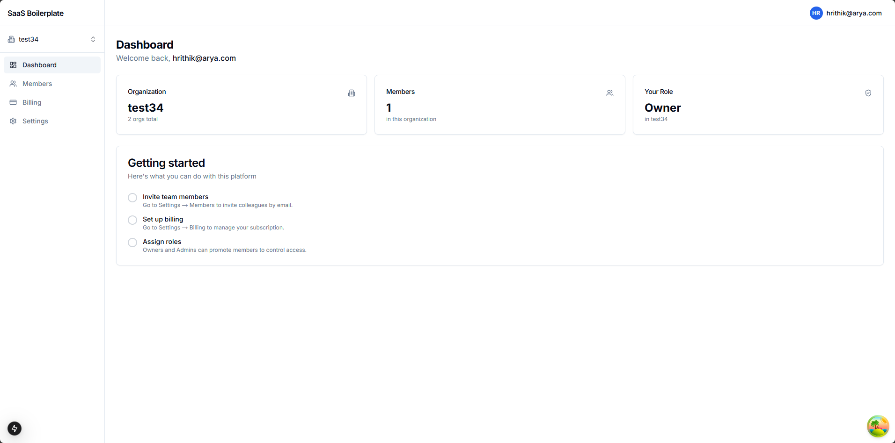
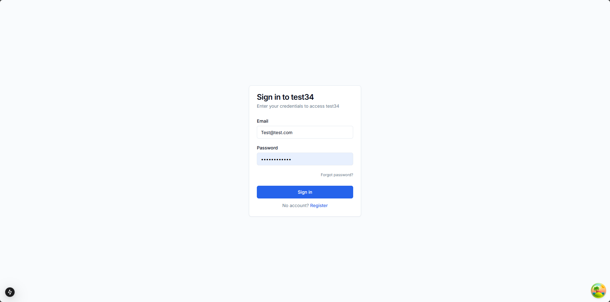
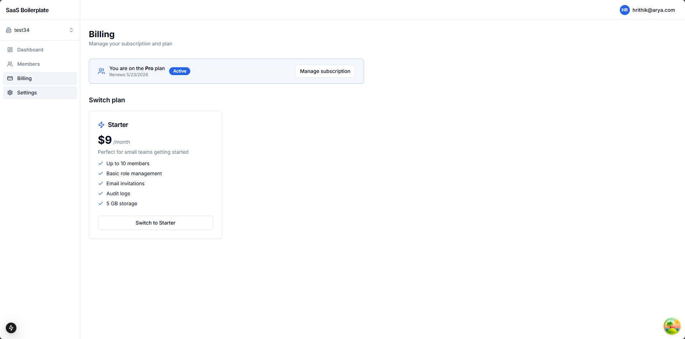
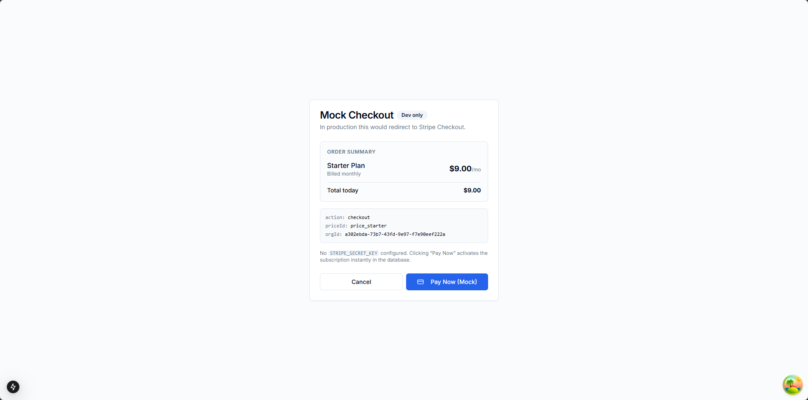
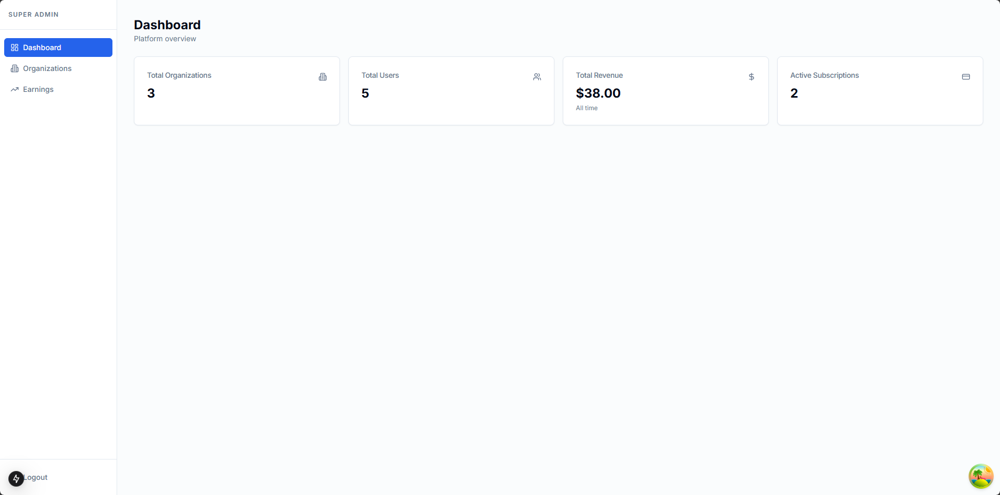
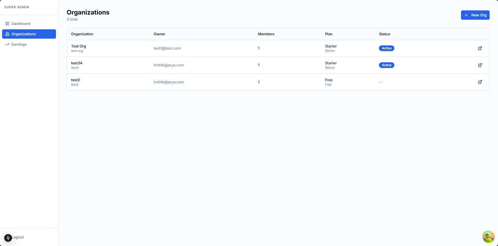
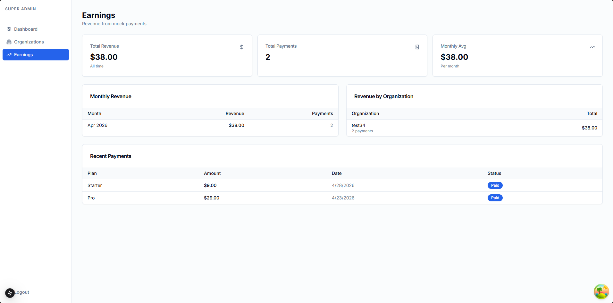
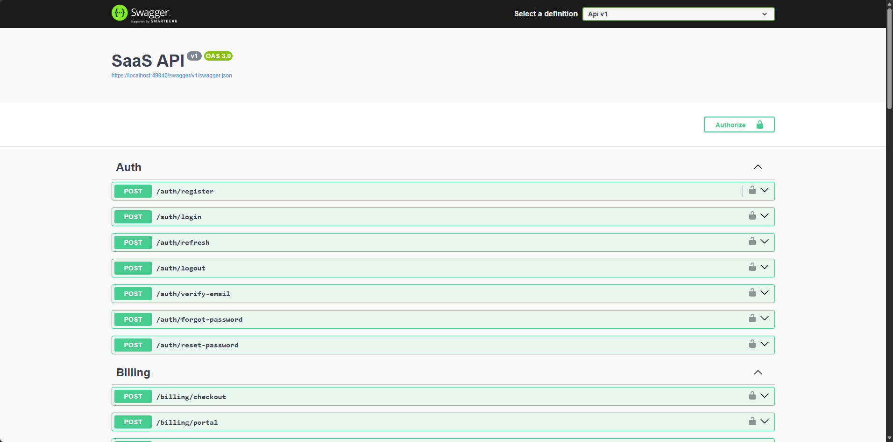

# SaaS RBAC Boilerplate

A production-ready, full-stack SaaS starter with multi-tenancy, role-based access control, Stripe billing, and a super-admin panel — built with **ASP.NET Core 8** and **Next.js 15**.

[](LICENSE)
[](https://dotnet.microsoft.com/)
[](https://nextjs.org/)
[](https://www.postgresql.org/)
[](https://www.docker.com/)
[](https://www.typescriptlang.org/)

---

## What's included

Skip the boilerplate and start building your product. This template gives you everything a multi-tenant SaaS needs on day one:

- **JWT auth** with refresh token rotation, email verification, and password reset
- **Multi-tenancy** — per-organization RBAC with subdomain routing (`{slug}.yourdomain.com`)
- **4-tier RBAC** — Owner, Admin, Member, Viewer with per-request permission caching
- **Stripe billing** — Checkout, Customer Portal, webhook handler, and feature gating by plan
- **Super-admin panel** — manage all tenants, plans, and track platform revenue
- **Production-ready** — rate limiting, security headers, structured logging, Docker + Nginx

---

## Screenshots

### Tenant Portal

<table>
  <tr>
    <td align="center"><b>Sign In</b></td>
    <td align="center"><b>Tenant Dashboard</b></td>
    <td align="center"><b>Members & Roles</b></td>
  </tr>
  <tr>
    <td></td>
    <td></td>
    <td></td>
  </tr>
  <tr>
    <td align="center"><b>Subdomain Login</b></td>
    <td align="center"><b>Billing & Plans</b></td>
    <td align="center"><b>Stripe Checkout</b></td>
  </tr>
  <tr>
    <td></td>
    <td></td>
    <td></td>
  </tr>
</table>

### Super Admin Panel

<table>
  <tr>
    <td align="center"><b>Platform Dashboard</b></td>
    <td align="center"><b>All Organizations</b></td>
    <td align="center"><b>Earnings Tracker</b></td>
  </tr>
  <tr>
    <td></td>
    <td></td>
    <td></td>
  </tr>
</table>

### REST API — Swagger UI



---

## Tech Stack

| Layer | Technology |
|---|---|
| Backend | ASP.NET Core 8, Clean Architecture |
| ORM | Entity Framework Core 8, PostgreSQL 14+ |
| Frontend | Next.js 15 (App Router), React 19, TypeScript |
| UI | Tailwind CSS, shadcn/ui |
| State | Zustand, TanStack React Query v5 |
| Auth | JWT Bearer, BCrypt.Net |
| Billing | Stripe SDK (mock fallback included) |
| Email | Resend API (no-ops silently in dev) |
| Caching | Redis — StackExchange.Redis (in-memory fallback) |
| Logging | Serilog → Seq |
| Testing | xUnit, NSubstitute, Testcontainers, Vitest |
| DevOps | Docker Compose, Nginx |

---

## Architecture

```
┌──────────────────┐     ┌──────────────────┐     ┌────────────┐
│   Next.js 15     │────▶│  ASP.NET Core 8  │────▶│ PostgreSQL │
│   (App Router)   │     │      API         │     │  (EF Core) │
└──────────────────┘     └────────┬─────────┘     └────────────┘
                                  │
                     ┌────────────┴────────────┐
                     │                         │
               ┌─────▼──────┐          ┌───────▼──────┐
               │   Redis    │          │    Resend    │
               │  (tokens,  │          │   (email)    │
               │permissions)│          └──────────────┘
               └────────────┘
```

**Backend layers (Clean Architecture):**

| Layer | Project | Responsibility |
|---|---|---|
| Domain | `Domain` | Entities, enums — zero dependencies |
| Application | `Application` | Business logic, service interfaces, DTOs |
| Infrastructure | `Infrastructure` | EF Core, Redis, Stripe, Resend adapters |
| API | `Api` | Controllers, middleware, auth policies, DI root |

**Request pipeline:**
```
Serilog → Security headers → Global exception handler → CORS
→ Rate limiter → JWT auth → OrganizationContext → RBAC → Controllers
```

---

## Quick Start

### Option A — Docker (one command)

```bash
git clone https://github.com/your-username/saas-rbac-um.git
cd saas-rbac-um
make dev
```

Starts PostgreSQL, Redis, Seq, backend, and frontend together.

| Service | URL |
|---|---|
| Frontend | http://localhost:3000 |
| Backend API | http://localhost:5000 |
| Swagger UI | http://localhost:5000/swagger |
| Seq log viewer | http://localhost:5341 |

### Option B — Local dev (no Docker)

```bash
# 1. Create the database
psql -U postgres -c "CREATE DATABASE saas_dev;"

# 2. Install frontend deps
npm install --prefix frontend

# 3. Start both services
make dev-local
```

Frontend → http://localhost:3300 · API → http://localhost:5000 · Swagger → http://localhost:5000/swagger

### Default credentials

| Role | Email | Password |
|---|---|---|
| Super Admin | `superadmin@localhost` | `SuperAdmin123!` |

The super admin account is seeded automatically on first startup.

---

## RBAC — Roles & Permissions

Each user has one role per organization. Roles are enforced by ASP.NET Core authorization policies with per-request Redis caching.

| Permission | Owner | Admin | Member | Viewer |
|---|:---:|:---:|:---:|:---:|
| `projects.read` | ✓ | ✓ | ✓ | ✓ |
| `projects.write` | ✓ | ✓ | ✓ | — |
| `members.manage` | ✓ | ✓ | — | — |
| `billing.manage` | ✓ | — | — | — |

- One **Owner** per org — cannot be demoted or removed
- Invites can assign Admin / Member / Viewer (not Owner)
- The frontend hides/disables UI based on the current user's role

---

## Billing

`IBillingService` has two implementations selected at startup:

| Implementation | When active |
|---|---|
| `StripeBillingService` | `STRIPE_SECRET_KEY` env var is set |
| `MockBillingService` | No key — simulates checkout + portal, no charges |

`IFeatureGate` reads `Plan.FeaturesJson` to gate features at runtime:

```json
{ "max_members": 3,  "advanced_reports": false }   // Free
{ "max_members": 20, "advanced_reports": true  }   // Pro
{ "max_members": 100,"advanced_reports": true  }   // Team
```

---

## Environment Variables

Copy `.env.example` to `.env`:

```env
DATABASE_URL=Host=localhost;Port=5432;Database=saas_dev;Username=postgres;Password=postgres
JWT_SECRET=your-secret-key-minimum-32-characters
APP_URL=http://localhost:3000

# Optional — mock fallback used when absent
STRIPE_SECRET_KEY=sk_test_...
STRIPE_WEBHOOK_SECRET=whsec_...
RESEND_API_KEY=re_...
REDIS_URL=redis://localhost:6379
```

---

## Project Structure

```
saas-rbac-um/
├── backend/
│   ├── src/
│   │   ├── Domain/          # Entities, enums — no dependencies
│   │   ├── Application/     # Business logic, service interfaces, DTOs
│   │   ├── Infrastructure/  # EF Core, Redis, Stripe, Resend adapters
│   │   └── Api/             # Controllers, middleware, auth policies
│   └── tests/
│       ├── Application.UnitTests/    # xUnit, NSubstitute, in-memory EF Core
│       └── Api.IntegrationTests/     # Full HTTP tests, Testcontainers
├── frontend/
│   └── src/
│       ├── app/             # Next.js App Router pages & layouts
│       ├── components/      # UI components (shadcn/ui + custom)
│       ├── stores/          # Zustand auth + org stores
│       └── lib/             # Axios client, React Query hooks
├── docs/
│   ├── architecture.md
│   ├── setup.md
│   └── screenshots/
├── docker/
│   └── nginx/               # Nginx reverse proxy config
├── docker-compose.yml       # Dev: Postgres + Redis + Seq + API + Frontend
├── docker-compose.prod.yml  # Production with Nginx on 80/443
└── Makefile                 # dev, dev-local, test, lint, migration, logs
```

---

## Running Tests

```bash
# Backend — unit tests (no external dependencies)
dotnet test backend/tests/Application.UnitTests

# Backend — integration tests (requires Docker for Testcontainers)
dotnet test backend/tests/Api.IntegrationTests

# Frontend — unit tests
npm test --prefix frontend

# Everything at once
make test
```

---

## Common Commands

| Command | Description |
|---|---|
| `make dev` | Start all services via Docker Compose |
| `make dev-local` | Start backend + frontend locally (no Docker) |
| `make stop` | Stop Docker services |
| `make test` | Run backend + frontend tests |
| `make lint` | Check formatting |
| `make migration` | Create a new EF Core migration |
| `make logs` | Tail backend logs |

---

## Deployment

See [docs/setup.md](docs/setup.md) for full production deployment instructions with Docker + Nginx + HTTPS.

---

## License

[MIT](LICENSE)
